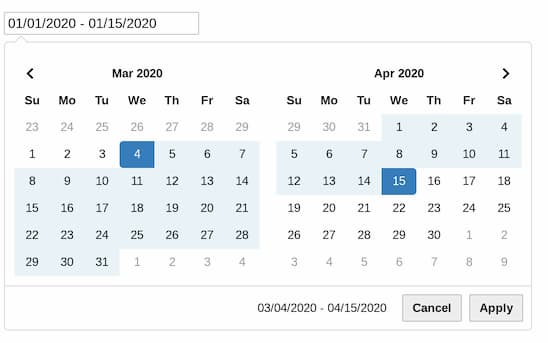

# pat-daterangepicker

A [Patternslib](http://patternslib.com) pattern.



## To see it in action

```
make all
```

Then visit port localhost:4001 in your browser

<input class="pat-daterangepicker">